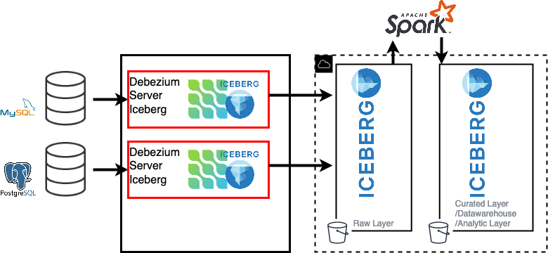

# Debezium Iceberg Consumers

This project adds iceberg consumer to [debezium server application](https://debezium.io/documentation/reference/operations/debezium-server.html). it could be used to
replicate database changes to iceberg table(Cloud storage, hdfs) without requiring Spark, Kafka or Streaming platform.

# Contributing
The Memiiso community welcomes anyone that wants to help out in any way, whether that includes reporting problems, helping with documentation, or contributing code changes to fix bugs, add tests, or implement new features. See [contributing document](CONTRIBUTE.md) for details.

### Contributors
