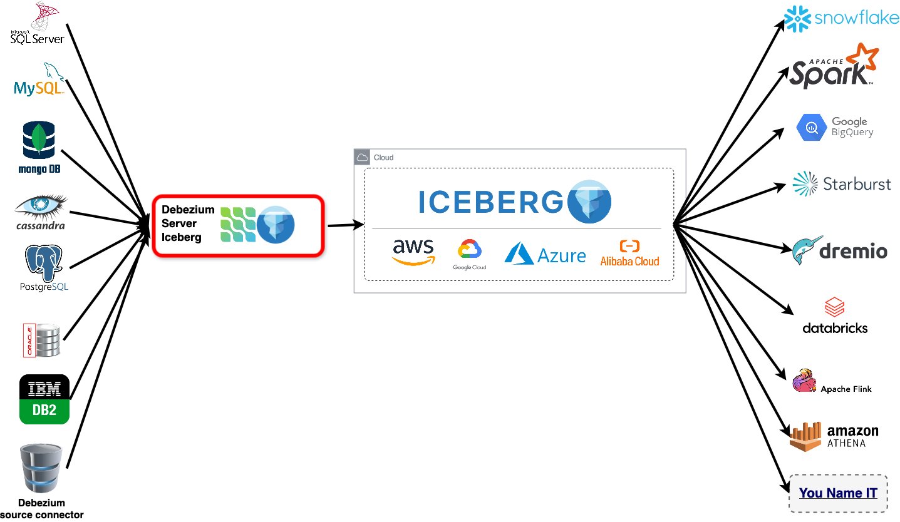

[](http://www.apache.org/licenses/LICENSE-2.0.html)


# Debezium Iceberg Consumer

This project adds Iceberg consumer
to [Debezium Server](https://debezium.io/documentation/reference/operations/debezium-server.html). It could be used to
replicate any database(CDC changes) to could as an Iceberg table in realtime. Without requiring Spark, Kafka or
Streaming platform. It's possible to consume data in append or update modes.

This project introduces an Iceberg consumer for [Debezium Server](https://debezium.io/documentation/reference/operations/debezium-server.html), enabling real-time replication of Change Data Capture (CDC) events from any database to an Iceberg table. This eliminates the need for additional tools like Spark, Kafka, or dedicated streaming platforms.  The consumer supports data ingestion in both append and upsert modes.

See the [Documentation Page](docs/DOCS.md) for more details
For a full understanding of current limitations and recommended solutions, please review the [caveats](docs/CAVEATS.md).



# Installation
- Requirements:
  - JDK 21
  - Maven
### Building from source code
1. Clone the repository
2. Navigate to the project root directory 
3. Create distribution package.
4. Extract the contents of the server distribution package
5. Enter into unzipped folder
6. Create `application.properties` file. An example configuration file named [application.properties.example](debezium-server-iceberg-dist%2Fsrc%2Fmain%2Fresources%2Fdistro%2Fconf%2Fapplication.properties.example) is provided for your reference.
7. Run the provided script: `bash run.sh` This script will launch the server using the configuration you defined in the application.properties file.

```bash
git clone https://github.com/memiiso/debezium-server-iceberg.git
cd debezium-server-iceberg
mvn -Passembly -Dmaven.test.skip package
unzip debezium-server-iceberg-dist/target/debezium-server-iceberg-dist*.zip -d appdist
cd appdist/debezium-server-iceberg
mv conf/application.properties.example conf/application.properties
bash run.sh
```

# Python Runner for Debezium Server

It's possible to use python to run,operate debezium server

For convenience this project additionally provides Python scripts to automate the startup, shutdown, and configuration of Debezium Server. 
Using Python, you can do various Debezium Server operation and take programmatic, dynamic, debezium configuration.
example:

```commandline
pip install git+https://github.com/memiiso/debezium-server-iceberg.git@master#subdirectory=python
debezium
# running with custom arguments
debezium --debezium_dir=/my/debezium_server/dir/ --java_home=/my/java/homedir/
```

```python
from debezium import Debezium

d = Debezium(debezium_dir="/dbz/server/dir", java_home='/java/home/dir')
java_args = []
java_args.append("-Dquarkus.log.file.enable=true")
java_args.append("-Dquarkus.log.file.path=/logs/dbz_logfile.log")
d.run(*java_args)
```

```python
import os
from debezium import DebeziumRunAsyn

java_args = []
# using python we can dynamically influence debezium 
# by chaning its config within python
if my_custom_condition_check is True:
    # Option 1: set config using java arg
    java_args.append("-Dsnapshot.mode=always")
    # Option 2: set config using ENV variable
    os.environ["SNAPSHOT_MODE"] = "always"

java_args.append("-Dquarkus.log.file.enable=true")
java_args.append("-Dquarkus.log.file.path=/logs/dbz_logfile.log")
d = DebeziumRunAsyn(debezium_dir="/dbz/server/dir", java_home='/java/home/dir', java_args=java_args)
d.run()
d.join()
```

# Contributing

The Memiiso community welcomes anyone that wants to help out in any way, whether that includes reporting problems,
helping with documentation, or contributing code changes to fix bugs, add tests, or implement new features.
See [contributing document](CONTRIBUTING.md) for details.

### Contributors

<a href="https://github.com/memiiso/debezium-server-iceberg/graphs/contributors">
  
</a>
